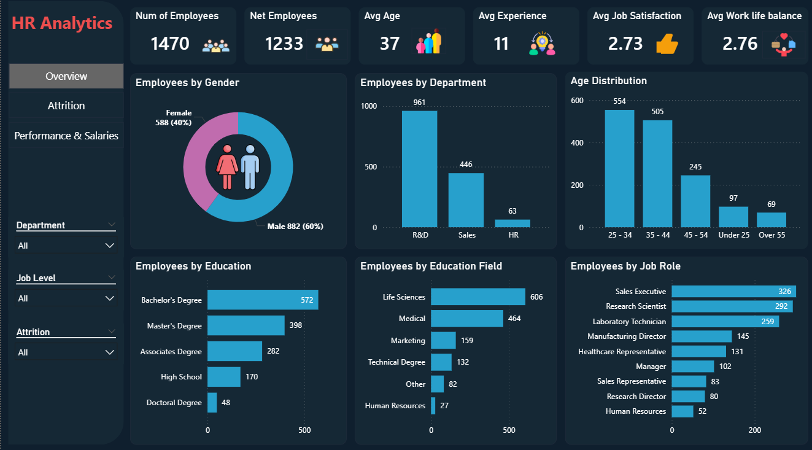
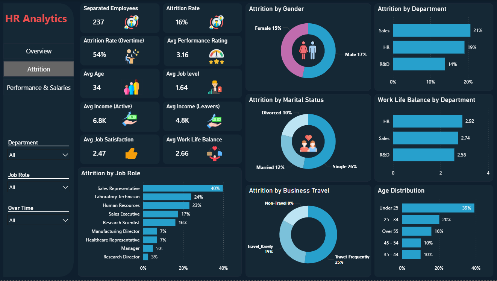
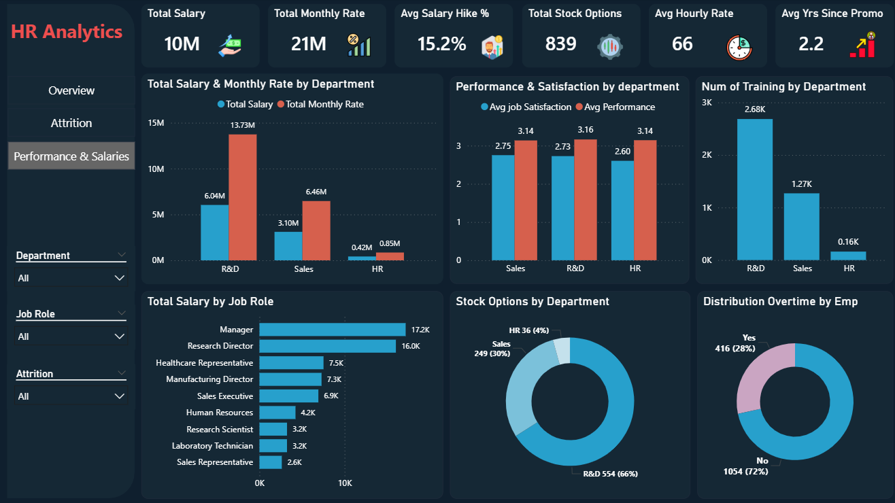
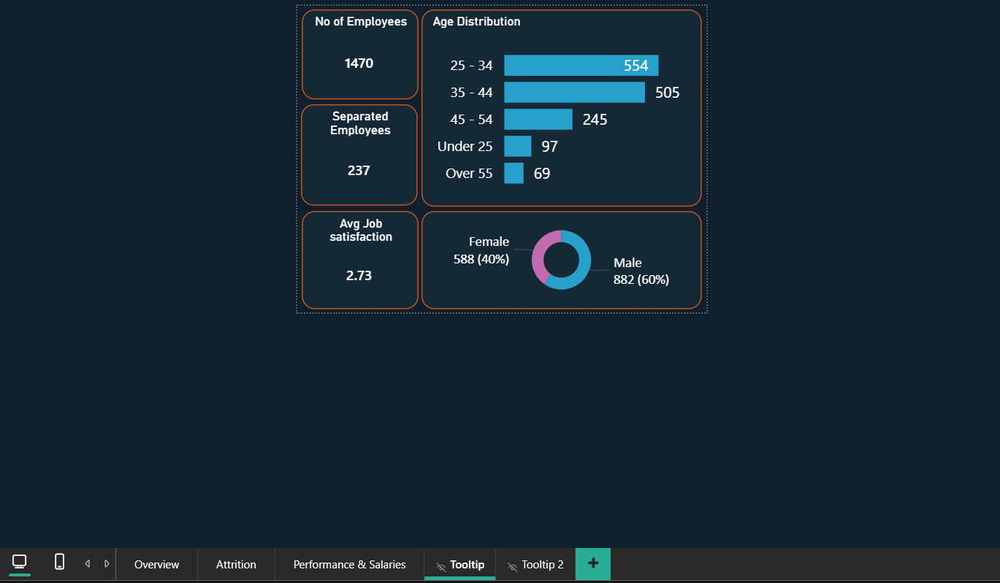

# HR Analytics Dashboard | Power BI

## Project Overview
This project is an interactive HR Analytics dashboard built using Power BI to analyze employee data, attrition trends, workforce distribution, and salary performance.  
The dashboard supports HR teams and decision-makers with data-driven insights to improve retention, workforce planning, and employee satisfaction.

## Objectives
- Analyze employee attrition and its key drivers  
- Understand workforce distribution by department, age, gender, and education  
- Evaluate performance, salary structure, and promotions  
- Monitor employee satisfaction and work-life balance  
- Support strategic HR decision-making  

## Key KPIs
- Total Employees: 1470  
- Separated Employees: 237  
- Attrition Rate: 16%  
- Average Age: 37  
- Average Experience: 11 years  
- Average Job Satisfaction: 2.73  
- Average Work-Life Balance: 2.76  

## Dashboard Sections

### Overview
- Workforce distribution by department, gender, and education  
- Age distribution analysis  
- Employees by job role and education field  

### Attrition Analysis
- Attrition rate by gender, department, marital status, and job role  
- Attrition vs overtime impact  
- Attrition by business travel frequency  
- Salary comparison between active employees and leavers  

### Performance and Salaries
- Total salary and monthly rate by department  
- Salary distribution by job role  
- Average performance rating and job satisfaction by department  
- Training distribution across departments  
- Stock options distribution  
- Promotion and overtime analysis  

## Key Insights
- Sales roles show higher attrition compared to other job roles  
- Employees working overtime have significantly higher attrition rates  
- Younger employees (25–34) represent the largest workforce segment  
- R&D department has the highest number of employees  
- Salary and performance vary across departments, impacting retention  
- Job satisfaction and work-life balance scores indicate room for improvement  

## Business Value
- Helps HR identify high-risk attrition segments  
- Supports workforce planning and hiring strategies  
- Enables salary and performance benchmarking  
- Assists in improving employee satisfaction and retention strategies  
- Provides visibility into training and promotion impact  

## Tools Used
- Power BI  
- Excel  
- HR Dataset  

## Dashboard Preview

### Overview

### Attrition

### Performance and Salaries

### Tooltip Analysis

